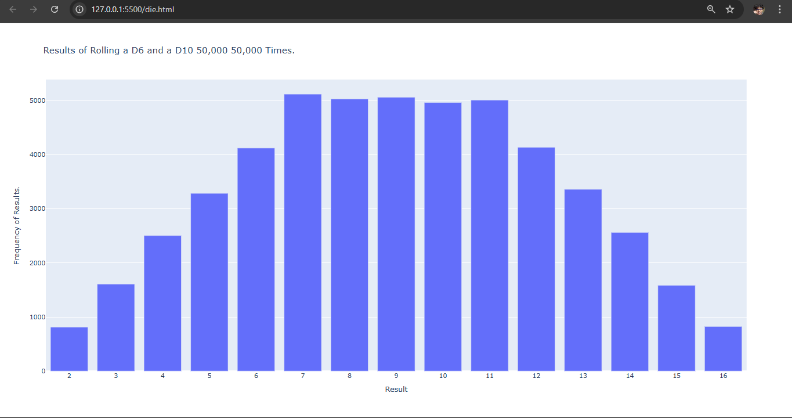

# Dice Roll Visualizer

This is a fun little Python project that simulates rolling a D6 (six-sided die) 1000 times and shows the results in a bar chart using Plotly.

## What it does

- Rolls a die 1000 times
- Tracks how often each number appears
- Plots the results in an interactive chart

## Tech used

- Python
- Plotly for the chart
- A custom `Die` class to handle the dice logic
